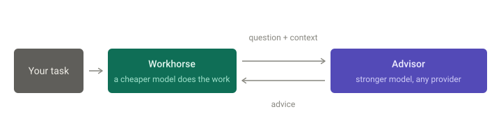
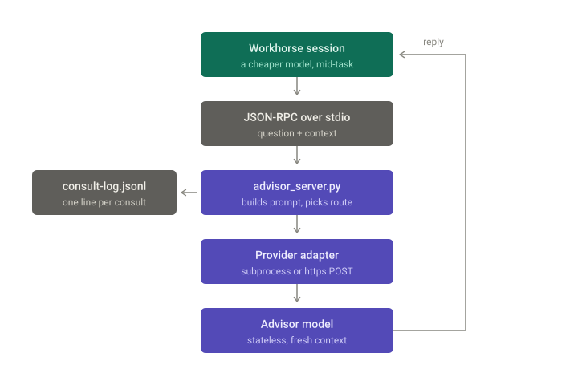

# The Advisor

Your cheap workhorse model consults a stronger advisor before hard-to-reverse decisions.
Fast and cheap by default, strong where it counts.

**Any model on either side.** The advisor can be Claude, Gemini, GPT, or a model running on
your own machine. The workhorse can be Claude Code, any MCP client, or a shell script.
Nothing is hardcoded — you pick both.



## Setup

Three steps. Requires `python3` — standard library only, nothing to install.

**1. Install**

```
/plugin marketplace add alitahir6001/the-advisor
```

```
/plugin install the-advisor@the-advisor
```

**2. Name your advisor.** Pick the strongest model you have access to:

```
/plugin configure the-advisor@the-advisor
```

Or set it at install time, no restart needed:

```bash
claude plugin install the-advisor@the-advisor --config advisor_model=claude-opus-5
```

This is the one step you shouldn't skip. Left blank, the `*-cli` providers fall back to
the CLI's own default — possibly no stronger than your workhorse, which defeats the point.

**3. Pick a cheap workhorse.** Run `/model`, choose something fast.

That's it. Consults now go to the strong model, everything else stays cheap.

## Model names

Model names are not validated here — they're passed straight to your provider, so a typo
fails on the first consult with that vendor's error. Names change often; check the source:

| Advisor | Current model names | Example |
|---|---|---|
| Claude | [platform.claude.com/docs/…/models/overview](https://platform.claude.com/docs/en/about-claude/models/overview) | `claude-opus-5` |
| Gemini | [ai.google.dev/gemini-api/docs/models](https://ai.google.dev/gemini-api/docs/models) | `gemini-3.1-pro-preview` |
| OpenAI | [developers.openai.com/api/docs/models](https://developers.openai.com/api/docs/models) | `gpt-5.6` |
| Local | `ollama list`, or your server's model list | `gemma3:latest` |

Examples as of August 2026. The `*-cli` providers also accept that CLI's own short
aliases, such as `opus` or `sonnet` for Claude.

## Using a different advisor

Step 2 assumes Claude. To point the advisor somewhere else, set `advisor_provider` in the
same `/plugin configure` screen:

| Advisor | `advisor_provider` | Also set |
|---|---|---|
| Claude, via your subscription | `anthropic-cli` (default) | `advisor_model` |
| Gemini, via your subscription | `gemini-cli` | `advisor_model` |
| Claude, via API credits | `anthropic-api` | `advisor_model`, `advisor_api_key` |
| GPT, via API credits | `openai-api` | `advisor_model`, `advisor_api_key` |
| **Local model** (ollama, LM Studio, vLLM) | `openai-compatible` | `advisor_model`, `advisor_base_url` |
| Gateway (OpenRouter, Groq, Together) | `openai-compatible` | `advisor_model`, `advisor_base_url`, `advisor_api_key` |

A local advisor needs no API key:

```bash
claude plugin install the-advisor@the-advisor \
  --config advisor_provider=openai-compatible \
  --config advisor_base_url=http://localhost:11434/v1 \
  --config advisor_model=gemma3:latest
```

`advisor_base_url` works with `openai-api` and `anthropic-api` too, if you route through a
proxy. Setting it makes the API key optional.

Leaving `advisor_api_key` blank falls back to `ANTHROPIC_API_KEY` / `OPENAI_API_KEY` from
your shell — so existing terminal setups keep working, and the desktop app (which never
reads your shell profile) has somewhere to put a key.

## Using a different workhorse

Not on Claude Code? Clone the repo — the server works on its own.

### Any MCP client

The server is plain MCP over stdio. Clone the repo and register it — Gemini CLI, for
example:

```bash
gemini mcp add advisor python3 /path/to/the-advisor/server/advisor_server.py \
  -e ADVISOR_PROVIDER=openai-compatible \
  -e ADVISOR_BASE_URL=http://localhost:11434/v1 \
  -e ADVISOR_MODEL=gemma3:latest
```

### No client at all

Same code path, one shot:

```bash
ADVISOR_PROVIDER=gemini-cli python3 server/advisor_server.py \
  "Queue or direct call here?" "Single node, 10 req/min, user waits on it."
```

Advice to stdout, errors to stderr, non-zero exit on failure — pipe it or wire it into
whatever agent you already have.

## Use it

Ask directly:

```
/advisor is a queue the right call here, or am I overbuilding?
```

Or let it escalate on its own — the bundled agent consults before architectural calls,
twice-failed fixes, and unresolvable tradeoffs, and stays quiet on routine work.

Route one question to an unconfigured provider (not logged, no restart needed):

```
/second-opinion ask gemini what it thinks about this schema
```

Read the log — every consult is appended as JSON:

```bash
python3 server/consults.py            # recent consults, one per line
python3 server/consults.py 3          # full entry 3
python3 server/consults.py --stats    # counts by provider and day
```

### Other settings

Everything is settable through `/plugin configure`. The server also reads the same values
straight from the environment, which is how the standalone and non-Claude-Code paths work:

| Variable | `/plugin configure` option | Values |
|---|---|---|
| `ADVISOR_PROVIDER` | `advisor_provider` | one of the five providers above |
| `ADVISOR_MODEL` | `advisor_model` | any model name your provider accepts |
| `ADVISOR_BASE_URL` | `advisor_base_url` | API root override; makes the API key optional |
| `ADVISOR_API_KEY` | `advisor_api_key` | falls back to the vendor's own key variable |
| `ADVISOR_LOG` | — | consult log path (defaults to the plugin's data directory) |

`*-cli` providers shell out to a CLI you're signed into, billing your subscription.
`*-api` providers bill credits. The vendor API paths have test coverage but no live call
has been made against them — no API keys on the author's machine. The local
`openai-compatible` path is exercised against ollama.

## How it works



| Component | Role |
|---|---|
| `agents/advisor.md` | Carries the escalation rule. Always in context. Fallback advisor when the MCP tool is down. |
| `server/advisor_server.py` | The `consult_advisor` MCP tool, and the standalone CLI. |
| `skills/` | `/advisor` for direct questions, `/second-opinion` for one-off calls to an unconfigured provider. |

The advisor is **stateless** — it sees only what the workhorse sends, never your session
history. That forces the workhorse to articulate the problem, which is half the value, and
it's why `context` matters: a non-Claude advisor can't read your files.

Run the tests with:

```bash
python3 -m unittest discover -s server -p 'test_*.py'
```

## Troubleshooting

**"Not logged in" / "OAuth session expired"** — the `anthropic-cli` provider needs the CLI
authenticated separately from your editor. Run `claude setup-token`.

If you launch Claude Code as a desktop app, `~/.zshrc` won't work — GUI apps don't source
shell rc files. Add a top-level `env` block to `~/.claude/settings.json` instead:

```json
{
  "env": {
    "CLAUDE_CODE_OAUTH_TOKEN": "<your token>"
  }
}
```

Consults fall back to the bundled agent meanwhile, so nothing breaks.

## Credits

Inspired by the advisor/executor pattern described in
[vanja.io/advisor-and-executor](https://vanja.io/advisor-and-executor/).

MIT licensed.
