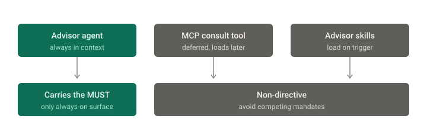

# The Advisor

A Claude Code plugin: your workhorse model consults a stronger advisor — Claude, Gemini,
or GPT — before hard-to-reverse decisions.


## Why

Frontier models are expensive and can be slower. Cheaper models can be faster but might
make bad architectural calls. This is a small plugin to get the best of both worlds.

## Install

```
/plugin marketplace add alitahir6001/the-advisor
```

```
/plugin install the-advisor@the-advisor
```

Requires `python3` — standard library only, nothing to install.

## Configure

**Set `ADVISOR_MODEL` to the strongest model you have access to.** This is the setting
that matters; leave it empty and the CLI's default answers, which may be no stronger than
your workhorse. Edit the plugin's `.mcp.json`:

| Variable | Values |
|---|---|
| `ADVISOR_PROVIDER` | `anthropic-cli` (default), `gemini-cli`, `anthropic-api`, `openai-api` |
| `ADVISOR_MODEL` | any model name your provider accepts |
| `ADVISOR_LOG` | consult log path (defaults to the plugin's data directory) |

The `anthropic-api` and `openai-api` adapters are written but untested — no API keys on
the author's machine. The two CLI adapters are exercised regularly. The consult log
stores questions, context, and replies verbatim, so treat it as you would your own
notes.

The `*-cli` providers shell out to a vendor CLI you're already signed into, billing your
existing subscription. The `*-api` providers use `ANTHROPIC_API_KEY` / `OPENAI_API_KEY`
and bill credits.

Then set your session to a cheaper model with `/model`. That's the workhorse.

## Use it

**Ask directly** — the common case:

```
/advisor is a queue the right call here, or am I overbuilding?
```

**Let it escalate.** The bundled agent carries a rule to get a second opinion before
architectural or hard-to-reverse decisions, twice-failed fixes, and unresolvable
tradeoffs — and to stay quiet on routine work. How reliably it fires on its own depends
on your workhorse model; smaller models need the directive phrasing this plugin ships
with.

**Cross-vendor** — route one question to a specific CLI:

```
/consult-advisor-cli ask gemini what it thinks about this schema
```

**Read the log.** Every consult is appended as JSON — question, context, verbatim reply,
provider, elapsed time:

```bash
python3 server/consults.py            # recent consults, one per line
python3 server/consults.py 3          # full entry 3
python3 server/consults.py --stats    # counts by provider and day
```

## How it works


| Component | Role |
|---|---|
| `agents/advisor.md` | Carries the escalation rule and routes consults. Always in context. Used as the fallback advisor when the MCP tool is unavailable — it runs on your default subagent model, so the MCP route is the real cross-model path. |
| `server/advisor_server.py` | The `consult_advisor` MCP tool. Preferred route — honors your provider config. |
| `skills/` | `/advisor` for direct questions, `/consult-advisor-cli` for one-off vendor calls. |

The server is a ~250-line MCP stdio server speaking newline-delimited JSON-RPC. It takes
two strings — `question` and `context` — wraps them in a fixed output contract
(Recommendation / Reasoning / Risks), dispatches to the configured provider by subprocess
or HTTPS, logs the exchange, and returns the reply.

The advisor is **stateless**: it sees only what the workhorse sends, never your session
history. That forces the workhorse to articulate the problem, which is half the value —
and it's why `context` matters, since a non-Claude advisor can't read your files.

### Where the escalation rule lives



The rule lives on the agent description, not the MCP tool. Tool schemas can be deferred
out of context until something searches for them, and a rule the model never sees can't
fire — testing overturned the opposite design here. The agent description is always
loaded, so that's where the policy belongs; everything else is deliberately non-directive
to avoid competing mandates.

## Troubleshooting

**"Not logged in" / "OAuth session expired"** — the `anthropic-cli` provider needs the
CLI itself authenticated, separately from your editor. Run `claude setup-token`.

Exporting the token in `~/.zshrc` is not enough if you launch Claude Code as a desktop
app: GUI apps don't source shell rc files, so the server and its subprocesses never see
it. Add an `env` block to `~/.claude/settings.json` instead — it applies however the session
was launched. It is a top-level key alongside the settings you already have, not a
separate file:

```json
{
  "model": "opus",
  "env": {
    "CLAUDE_CODE_OAUTH_TOKEN": "sk-ant-oat01-..."
  }
}
```

Consults fall back to the bundled agent meanwhile, so nothing breaks.

## Credits

Inspired by the advisor/executor pattern described in
[vanja.io/advisor-and-executor](https://vanja.io/advisor-and-executor/).

MIT licensed.
